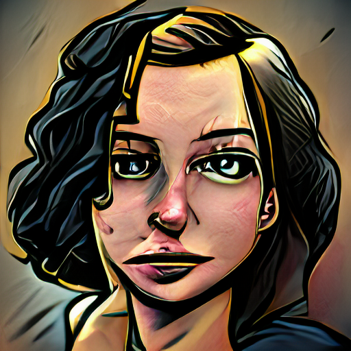
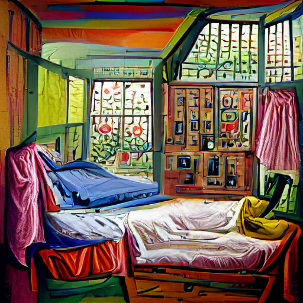
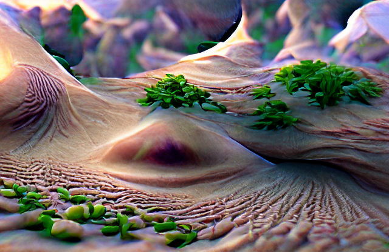
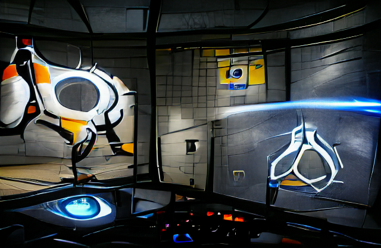
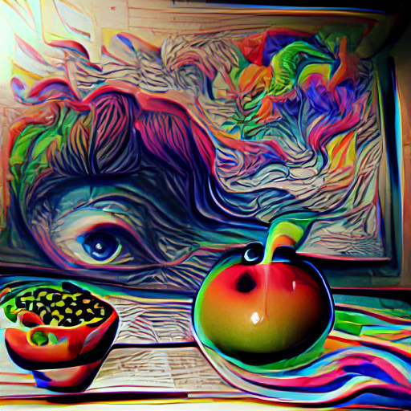
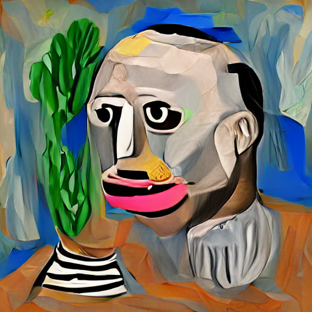

# VQGAN-CLIP Overview

A repo for running VQGAN+CLIP locally. This started out as a Katherine Crowson VQGAN+CLIP derived Google colab notebook.

<a href="https://replicate.ai/nerdyrodent/vqgan-clip"></a>

Original notebook: [![Open In Colab][colab-badge]][colab-notebook]

[colab-notebook]: <https://colab.research.google.com/drive/1ZAus_gn2RhTZWzOWUpPERNC0Q8OhZRTZ>
[colab-badge]: <https://colab.research.google.com/assets/colab-badge.svg>

Some example images:

</img></img></img>
</img></img></img>
</img></img>

Environment:

* Tested on Ubuntu 20.04
* GPU: Nvidia RTX 3090
* Typical VRAM requirements:
  * 24 GB for a 900x900 image
  * 10 GB for a 512x512 image
  * 8 GB for a 380x380 image

You may also be interested in [CLIP Guided Diffusion](https://github.com/nerdyrodent/CLIP-Guided-Diffusion)

## Set up

This example uses [Anaconda](https://www.anaconda.com/products/individual#Downloads) to manage virtual Python environments.

Create a new virtual Python environment for VQGAN-CLIP:

```sh
conda create --name vqgan python=3.9
conda activate vqgan
```

Install Pytorch in the new enviroment:

Note: This installs the CUDA version of Pytorch, if you want to use an AMD graphics card, read the [AMD section below](#using-an-amd-graphics-card).

```sh
pip install torch==1.9.0+cu111 torchvision==0.10.0+cu111 torchaudio==0.9.0 -f https://download.pytorch.org/whl/torch_stable.html
```

Install other required Python packages:

```sh
pip install ftfy regex tqdm omegaconf pytorch-lightning IPython kornia imageio imageio-ffmpeg einops torch_optimizer setuptools==59.5.0
```

Or use the ```requirements.txt``` file, which includes version numbers.

Clone required repositories:

```sh
git clone 'https://github.com/nerdyrodent/VQGAN-CLIP'
cd VQGAN-CLIP
git clone 'https://github.com/openai/CLIP'
git clone 'https://github.com/CompVis/taming-transformers'
```

Note: In my development environment both CLIP and taming-transformers are present in the local directory, and so aren't present in the `requirements.txt` or `vqgan.yml` files.

As an alternative, you can also pip install taming-transformers and CLIP.

You will also need at least 1 VQGAN pretrained model. E.g.

```sh
mkdir checkpoints

curl -L -o checkpoints/vqgan_imagenet_f16_16384.yaml -C - 'https://heibox.uni-heidelberg.de/d/a7530b09fed84f80a887/files/?p=%2Fconfigs%2Fmodel.yaml&dl=1' #ImageNet 16384
curl -L -o checkpoints/vqgan_imagenet_f16_16384.ckpt -C - 'https://heibox.uni-heidelberg.de/d/a7530b09fed84f80a887/files/?p=%2Fckpts%2Flast.ckpt&dl=1' #ImageNet 16384
```
Note that users of ```curl``` on Microsoft Windows should use double quotes.

The `download_models.sh` script is an optional way to download a number of models. By default, it will download just 1 model.

See <https://github.com/CompVis/taming-transformers#overview-of-pretrained-models> for more information about VQGAN pre-trained models, including download links.

By default, the model .yaml and .ckpt files are expected in the `checkpoints` directory.
See <https://github.com/CompVis/taming-transformers> for more information on datasets and models.

Video guides are also available:
* Linux - https://www.youtube.com/watch?v=1Esb-ZjO7tw
* Windows - https://www.youtube.com/watch?v=XH7ZP0__FXs

### Using an AMD graphics card

Note: This hasn't been tested yet.

ROCm can be used for AMD graphics cards instead of CUDA. You can check if your card is supported here:
<https://github.com/RadeonOpenCompute/ROCm#supported-gpus>

Install ROCm accordng to the instructions and don't forget to add the user to the video group:
<https://rocmdocs.amd.com/en/latest/Installation_Guide/Installation-Guide.html>

The usage and set up instructions above are the same, except for the line where you install Pytorch.
Instead of `pip install torch==1.9.0+cu111 ...`, use the one or two lines which are displayed here (select Pip -> Python-> ROCm):
<https://pytorch.org/get-started/locally/>

### Using the CPU

If no graphics card can be found, the CPU is automatically used and a warning displayed.

Regardless of an available graphics card, the CPU can also be used by adding this command line argument: `-cd cpu`

This works with the CUDA version of Pytorch, even without CUDA drivers installed, but doesn't seem to work with ROCm as of now.

### Uninstalling

Remove the Python enviroment:

```sh
conda remove --name vqgan --all
```

and delete the `VQGAN-CLIP` directory.

## Run

To generate images from text, specify your text prompt as shown in the example below:

```sh
python generate.py -p "A painting of an apple in a fruit bowl"
```

</img>

## Multiple prompts

Text and image prompts can be split using the pipe symbol in order to allow multiple prompts.
You can also use a colon followed by a number to set a weight for that prompt. For example:

```sh
python generate.py -p "A painting of an apple in a fruit bowl | psychedelic | surreal:0.5 | weird:0.25"
```

</img>

Image prompts can be split in the same way. For example:

```sh
python generate.py -p "A picture of a bedroom with a portrait of Van Gogh" -ip "samples/VanGogh.jpg | samples/Bedroom.png"
```

### Story mode

Sets of text prompts can be created using the caret symbol, in order to generate a sort of story mode. For example:

```sh
python generate.py -p "A painting of a sunflower|photo:-1 ^ a painting of a rose ^ a painting of a tulip ^ a painting of a daisy flower ^ a photograph of daffodil" -cpe 1500 -zvid -i 6000 -zse 10 -vl 20 -zsc 1.005 -opt Adagrad -lr 0.15 -se 6000
```


## "Style Transfer"

An input image with style text and a low number of iterations can be used create a sort of "style transfer" effect. For example:

```sh
python generate.py -p "A painting in the style of Picasso" -ii samples/VanGogh.jpg -i 80 -se 10 -opt AdamW -lr 0.25
```

| Output                                                        | Style       |
| ------------------------------------------------------------- | ----------- |
| </img>     | Picasso     |
| </img>      | Sketch      |
| </img> | Psychedelic |

A video style transfer effect can be achived by specifying a directory of video frames in `video_style_dir`. Output will be saved in the steps directory, using the original video frame filenames. You can also use this as a sort of "batch mode" if you have a directory of images you want to apply a style to. This can also be combined with Story Mode if you don't wish to apply the same style to every images, but instead roll through a list of styles.

## Feedback example

By feeding back the generated images and making slight changes, some interesting effects can be created.

The example `zoom.sh` shows this by applying a zoom and rotate to generated images, before feeding them back in again.
To use `zoom.sh`, specifying a text prompt, output filename and number of frames. E.g.

```sh
./zoom.sh "A painting of a red telephone box spinning through a time vortex" Telephone.png 150
```
If you don't have ImageMagick installed, you can install it with ```sudo apt install imagemagick```

</img>

There is also a simple zoom video creation option available. For example:
```sh
python generate.py -p "The inside of a sphere" -zvid -i 4500 -zse 20 -vl 10 -zsc 0.97 -opt Adagrad -lr 0.15 -se 4500
```

## Random text example

Use `random.sh` to make a batch of images from random text. Edit the text and number of generated images to your taste!

```sh
./random.sh
```

## Advanced options

To view the available options, use "-h".

```sh
python generate.py -h
```

```sh
usage: generate.py [-h] [-p PROMPTS] [-ip IMAGE_PROMPTS] [-i MAX_ITERATIONS] [-se DISPLAY_FREQ]
[-s SIZE SIZE] [-ii INIT_IMAGE] [-in INIT_NOISE] [-iw INIT_WEIGHT] [-m CLIP_MODEL]
[-conf VQGAN_CONFIG] [-ckpt VQGAN_CHECKPOINT] [-nps [NOISE_PROMPT_SEEDS ...]]
[-npw [NOISE_PROMPT_WEIGHTS ...]] [-lr STEP_SIZE] [-cuts CUTN] [-cutp CUT_POW] [-sd SEED]
[-opt {Adam,AdamW,Adagrad,Adamax,DiffGrad,AdamP,RAdam,RMSprop}] [-o OUTPUT] [-vid] [-zvid]
[-zs ZOOM_START] [-zse ZOOM_FREQUENCY] [-zsc ZOOM_SCALE] [-cpe PROMPT_FREQUENCY]
[-vl VIDEO_LENGTH] [-ofps OUTPUT_VIDEO_FPS] [-ifps INPUT_VIDEO_FPS] [-d]
[-aug {Ji,Sh,Gn,Pe,Ro,Af,Et,Ts,Cr,Er,Re} [{Ji,Sh,Gn,Pe,Ro,Af,Et,Ts,Cr,Er,Re} ...]]
[-cd CUDA_DEVICE]
```

```sh
optional arguments:
  -h, --help            show this help message and exit
  -p PROMPTS, --prompts PROMPTS
                        Text prompts
  -ip IMAGE_PROMPTS, --image_prompts IMAGE_PROMPTS
                        Image prompts / target image
  -i MAX_ITERATIONS, --iterations MAX_ITERATIONS
                        Number of iterations
  -se DISPLAY_FREQ, --save_every DISPLAY_FREQ
                        Save image iterations
  -s SIZE SIZE, --size SIZE SIZE
                        Image size (width height) (default: [512, 512])
  -ii INIT_IMAGE, --init_image INIT_IMAGE
                        Initial image
  -in INIT_NOISE, --init_noise INIT_NOISE
                        Initial noise image (pixels or gradient)
  -iw INIT_WEIGHT, --init_weight INIT_WEIGHT
                        Initial weight
  -m CLIP_MODEL, --clip_model CLIP_MODEL
                        CLIP model (e.g. ViT-B/32, ViT-B/16)
  -conf VQGAN_CONFIG, --vqgan_config VQGAN_CONFIG
                        VQGAN config
  -ckpt VQGAN_CHECKPOINT, --vqgan_checkpoint VQGAN_CHECKPOINT
                        VQGAN checkpoint
  -nps [NOISE_PROMPT_SEEDS ...], --noise_prompt_seeds [NOISE_PROMPT_SEEDS ...]
                        Noise prompt seeds
  -npw [NOISE_PROMPT_WEIGHTS ...], --noise_prompt_weights [NOISE_PROMPT_WEIGHTS ...]
                        Noise prompt weights
  -lr STEP_SIZE, --learning_rate STEP_SIZE
                        Learning rate
  -cuts CUTN, --num_cuts CUTN
                        Number of cuts
  -cutp CUT_POW, --cut_power CUT_POW
                        Cut power
  -sd SEED, --seed SEED
                        Seed
  -opt, --optimiser {Adam,AdamW,Adagrad,Adamax,DiffGrad,AdamP,RAdam,RMSprop}
                        Optimiser
  -o OUTPUT, --output OUTPUT
                        Output file
  -vid, --video         Create video frames?
  -zvid, --zoom_video   Create zoom video?
  -zs ZOOM_START, --zoom_start ZOOM_START
                        Zoom start iteration
  -zse ZOOM_FREQUENCY, --zoom_save_every ZOOM_FREQUENCY
                        Save zoom image iterations
  -zsc ZOOM_SCALE, --zoom_scale ZOOM_SCALE
                        Zoom scale
  -cpe PROMPT_FREQUENCY, --change_prompt_every PROMPT_FREQUENCY
                        Prompt change frequency
  -vl VIDEO_LENGTH, --video_length VIDEO_LENGTH
                        Video length in seconds
  -ofps OUTPUT_VIDEO_FPS, --output_video_fps OUTPUT_VIDEO_FPS
                        Create an interpolated video (Nvidia GPU only) with this fps (min 10. best set to 30 or 60)
  -ifps INPUT_VIDEO_FPS, --input_video_fps INPUT_VIDEO_FPS
                        When creating an interpolated video, use this as the input fps to interpolate from (>0 & <ofps)
  -d, --deterministic   Enable cudnn.deterministic?
  -aug, --augments {Ji,Sh,Gn,Pe,Ro,Af,Et,Ts,Cr,Er,Re} [{Ji,Sh,Gn,Pe,Ro,Af,Et,Ts,Cr,Er,Re} ...]
                        Enabled augments
  -cd CUDA_DEVICE, --cuda_device CUDA_DEVICE
                        Cuda device to use
```

## Troubleshooting

### CUSOLVER_STATUS_INTERNAL_ERROR

For example:

`RuntimeError: cusolver error: CUSOLVER_STATUS_INTERNAL_ERROR, when calling cusolverDnCreate(handle)`

Make sure you have specified the correct size for the image.

### RuntimeError: CUDA out of memory

For example:

`RuntimeError: CUDA out of memory. Tried to allocate 150.00 MiB (GPU 0; 23.70 GiB total capacity; 21.31 GiB already allocated; 78.56 MiB free; 21.70 GiB reserved in total by PyTorch)`

Your request doesn't fit into your GPU's VRAM. Reduce the image size and/or number of cuts.


## Citations

```bibtex
@misc{unpublished2021clip,
    title  = {CLIP: Connecting Text and Images},
    author = {Alec Radford, Ilya Sutskever, Jong Wook Kim, Gretchen Krueger, Sandhini Agarwal},
    year   = {2021}
}
```

```bibtex
@misc{esser2020taming,
      title={Taming Transformers for High-Resolution Image Synthesis}, 
      author={Patrick Esser and Robin Rombach and Björn Ommer},
      year={2020},
      eprint={2012.09841},
      archivePrefix={arXiv},
      primaryClass={cs.CV}
}
```

Katherine Crowson - <https://github.com/crowsonkb>

Public Domain images from Open Access Images at the Art Institute of Chicago - <https://www.artic.edu/open-access/open-access-images>
