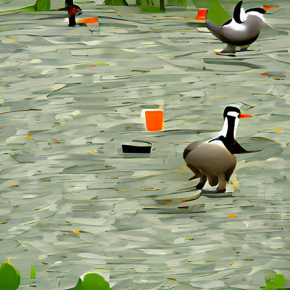
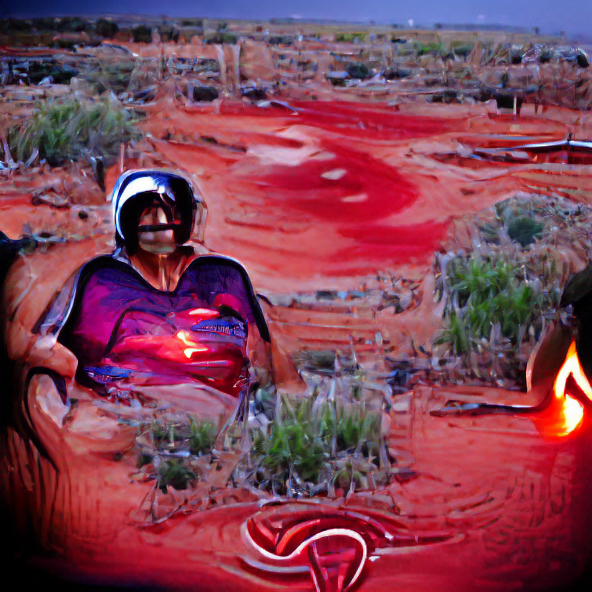
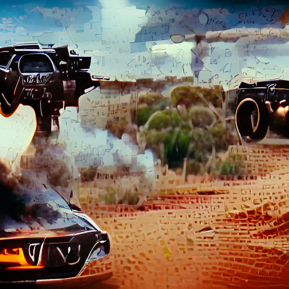
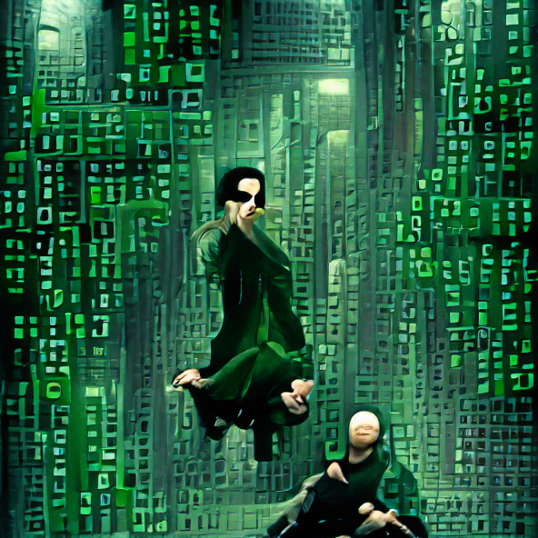

# ACMI API x VQGAN+CLIP

An example of what you can build with the [ACMI Public API](https://github.com/ACMILabs/acmi-api).

This code uses the ACMI Public API to return a random image from the first `50` Collection Works, and then passes on its metadata to `VQGAN+CLIP` to generate images and a video of each iteration step from that metadata.

Visit our API at: [api.acmi.net.au](https://api.acmi.net.au)

## Run it on Google Colab

The Jupyter Notebook code to run this on [Google Colab](https://colab.research.google.com) can be found in in the file `ACMI_Public_API_x_VQGAN+CLIP_(with_pooling).ipynb`.

Run it in Google Colab: [![Open In Colab][colab-badge]][colab-notebook]

[colab-notebook]: <https://colab.research.google.com/drive/1qBbpgsZR1UFhFhj-aDEF75tCCihkjOaI>
[colab-badge]: <https://colab.research.google.com/assets/colab-badge.svg>

To generate images:

* Click `Connect` on the top right in Google Colab to have infrastructure allocated to you
* Click the `play` button on the top left of each step to run that step
* Wait for a step to complete with a green tick before clicking the next step
* **Note**: the image generation iterations take ~15 minutes to run

### Samples

Below are some pre-generated images and the metadata that they were generated from.

</img></img>

**Source**: [ACMI API](https://api.acmi.net.au/works/118201/) - view this record on the [ACMI Website](https://www.acmi.net.au/works/118201--untitled-goose-game/)

**Metadata**: `['Untitled Goose Game', 'Untitled Goose Game is a slapstick-stealth-sandbox, where you are a goose let loose on an unsuspecting village. Make your way around town, from peoples’ back gardens to the high street shops to the village green, setting up pranks, stealing hats, honking a lot, and generally ruining everyone’s day.']`

---

</img></img>

**Source**: [ACMI API](https://api.acmi.net.au/works/81533/) - view this record on the [ACMI Website](https://www.acmi.net.au/works/81533--night-cries-a-rural-tragedy-a/)

**Metadata**: `['Night cries a rural tragedy', 'In the red glow of the outback an Aboriginal woman nurses her ill white mother. As we watch the old woman dying her daughter confronts the finality of death; the bitterness of memory. Shot entirely in a studio “Night cries” uses a stark set-design, a palette of colours as from a dream, and a haunting soundtrack of bush noises, gasping breath, the wail of a dingo, to suggest a world that combines the frightening distortion of a nightmare and the painful isolation of human loss. Subtitled “a rural tragedy” the film’s portrayal of a personal agony illuminates and exposes the general horror of Australia’s race history. With Marcia Langton, Agnes Hardwick and Jimmy Little']`

---

</img></img>

**Source**: [ACMI API](https://api.acmi.net.au/works/107804/) - view this record on the [ACMI Website](https://www.acmi.net.au/works/107804--mad-max-v8-interceptor-replica/)

**Metadata**: `['Mad Max V8 Interceptor replica', 'George Miller’s Mad Max revolutionised movies when it tore through cinemas in 1979. Max Rockatansky’s journey dispensing justice across the wasteland in his V8 Interceptor became a cult classic and catapulted Australian cinema onto the world stage.']`

---

</img></img>

**Source**: [ACMI API](https://api.acmi.net.au/works/74/) - view this record on the [ACMI Website](https://www.acmi.net.au/works/74--the-matrix/)

**Metadata**: `['The Matrix', 'Set in the 22nd century, The Matrix tells the story of a computer hacker who joins a group of underground insurgents fighting the vast and powerful computers who now rule the earth.']`

## Run it locally

The code to run VQGAN+CLIP locally is in the [/local](/local) folder. See the `README` in that folder for full instructions.

## Big thanks

This Notebook includes the amazing work of [Katherine Crowson](https://github.com/crowsonkb). 🥰

## Feedback/improvements

If you have any suggestions for improvements or bug fixes, we'd love you to [create an issue](https://github.com/ACMILabs/ACMI-API-x-VQGAN-CLIP/issues/new).

Alternatively feel free to [tweet at us too](https://twitter.com/ACMILabs), and use the hashtag [#ACMIapi](https://twitter.com/hashtag/ACMIapi) if you post any generated images/videos/gifs!

## Citations

```bibtex
@misc{unpublished2021clip,
    title  = {CLIP: Connecting Text and Images},
    author = {Alec Radford, Ilya Sutskever, Jong Wook Kim, Gretchen Krueger, Sandhini Agarwal},
    year   = {2021}
}
```

```bibtex
@misc{esser2020taming,
      title={Taming Transformers for High-Resolution Image Synthesis}, 
      author={Patrick Esser and Robin Rombach and Björn Ommer},
      year={2020},
      eprint={2012.09841},
      archivePrefix={arXiv},
      primaryClass={cs.CV}
}
```

Katherine Crowson - <https://github.com/crowsonkb>

ACMI Labs - <https://github.com/ACMILabs>

Public Domain images from Open Access Images at the Art Institute of Chicago - <https://www.artic.edu/open-access/open-access-images>
